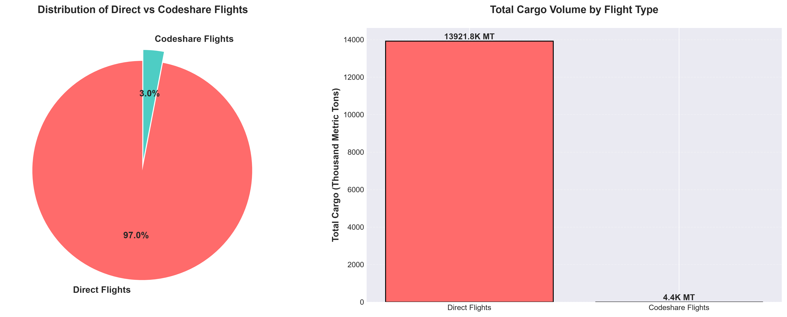

# ✈️ SFO Air Traffic Cargo Statistics — Data Analysis Project


> **Transforming 26 years of raw SFO cargo operational data into actionable business intelligence — enabling data-driven decisions for airport operations, airline partnerships, and cargo route optimization.**

---
   Codeshare Analysis Chart
 

## 🎯 Business Problem & Solution

### The Challenge

San Francisco International Airport (SFO) handles millions of pounds of air cargo annually across 134+ airlines and 9 geographic regions. Stakeholders needed answers to critical business questions:

- **Which airlines and routes drive the most cargo volume?**
- **How has cargo traffic evolved over 26 years, and what external factors impact it?**
- **Which cargo types and aircraft configurations are most efficient?**
- **What are the seasonal and geographic patterns in cargo operations?**

Raw data alone couldn't answer these questions — it required cleaning, validation, and transformation into decision-ready insights.

### The Solution

This project delivers a **complete end-to-end data analysis pipeline** that transforms 58,346 raw records into a professional 7-sheet Excel workbook with executive summaries, trend analysis, and actionable insights for airport management, airline partners, and logistics stakeholders.

---

## 📊 Project Overview

This comprehensive data analysis project covers **58,346 records** of air cargo activity at SFO spanning **26 years (1999–2025)**. The analysis transforms raw operational data into clean, decision-ready insights covering:

- Cargo volume trends and year-over-year growth
- Airline performance rankings and market share
- Geographic distribution and regional dominance
- Cargo type breakdowns (Cargo, Mail, Express)
- Aircraft type efficiency analysis
- Complete data quality audit trail

**Deliverable:** A professional 7-sheet Excel workbook with interactive charts, executive summaries, and stakeholder-ready reporting.

---

## 💼 Business Value & Use Cases

### Who Benefits from This Analysis?

| Stakeholder | Business Value |
|-------------|----------------|
| **Airport Operations** | Identify peak cargo periods, optimize resource allocation, and plan infrastructure investments |
| **Airline Partners** | Benchmark performance against competitors, identify growth opportunities, and optimize route strategies |
| **Cargo Logistics Companies** | Understand market dynamics, identify high-volume regions, and optimize supply chain routes |
| **Economic Development** | Track SFO's role in global trade corridors and support business attraction efforts |
| **Data Analysts** | Reference implementation for data cleaning, EDA, and professional reporting best practices |

### Key Business Questions Answered

✅ **What is the long-term cargo growth trajectory at SFO?**  
→ Annual trend analysis with YoY growth rates reveals 26-year patterns and COVID-19 impact

✅ **Which geographic regions are most critical for cargo operations?**  
→ Asia leads international cargo, followed by Europe; Domestic US remains #1 overall

✅ **Who are the dominant cargo carriers?**  
→ United Airlines leads all-time tonnage, followed by Korean Air Lines and EVA Airways

✅ **What cargo types and aircraft configurations drive efficiency?**  
→ Freighter aircraft carry significantly more tonnage than passenger belly cargo

✅ **How reliable is the underlying data?**  
→ Complete audit trail shows zero duplicates, zero nulls, and 100% weight conversion accuracy

---

## 📁 Repository Structure

```
sfo-air-cargo-analysis/
│
├── data/
│   └── Air_Traffic_Cargo_Statistics.xlsx     # Raw source data (58,346 records)
│
├── output/
│   └── SFO_Air_Cargo_Analysis.xlsx           # Final cleaned & analysed workbook (7 sheets)
│
├── notebook/
│   └── sfo_cargo_analysis.py                 # Full analysis script with documentation
│
└── README.md
```

---

## 📈 Dataset Summary

| Attribute | Value | Business Significance |
|-----------|-------|----------------------|
| **Source** | San Francisco International Airport (SFO) | Major US gateway for Asia-Pacific trade |
| **Time Range** | July 1999 – December 2025 | 26 years of historical data for trend analysis |
| **Total Records** | 58,346 | Comprehensive coverage of cargo operations |
| **Airlines Tracked** | 134 | Full competitive landscape analysis |
| **Geographic Regions** | 9 | Global trade route insights |
| **Cargo Types** | Cargo, Mail, Express | Detailed cargo segmentation |
| **Aircraft Types** | Passenger, Freighter, Combi | Operational efficiency analysis |
| **Data Freshness** | As of 2026-02-20 | Current and relevant for decision-making |

### Raw Column Reference

| Column | Description | Business Use |
|--------|-------------|--------------|
| `Activity Period` | Period in YYYYMM format | Time-series analysis and seasonal patterns |
| `Activity Period Start Date` | Start date (converted from Excel serial) | Accurate temporal analysis |
| `Operating Airline` | Airline operating the flight | Carrier performance benchmarking |
| `Operating Airline IATA Code` | IATA code of operating airline | Standardized airline identification |
| `Published Airline` | Airline on the ticket / codeshare partner | Partnership and codeshare analysis |
| `Published Airline IATA Code` | IATA code of published airline | Codeshare relationship tracking |
| `GEO Summary` | Domestic or International | Market segmentation |
| `GEO Region` | US, Asia, Europe, Canada, Mexico, etc. | Regional market share analysis |
| `Activity Type Code` | Enplaned (loaded) or Deplaned (unloaded) | Trade flow analysis (imports vs exports) |
| `Cargo Type Code` | Cargo / Mail / Express | Cargo mix optimization |
| `Cargo Aircraft Type` | Freighter / Passenger / Combi | Fleet and capacity planning |
| `Cargo Weight LBS` | Weight in pounds | Primary volume metric |
| `Cargo Metric TONS` | Weight in metric tons | Standardized international metric |
| `data_as_of` | Dataset snapshot date | Data lineage and versioning |
| `data_loaded_at` | ETL load timestamp | ETL process monitoring |

---

## 🧹 Data Cleaning & Quality Assurance

### Data Quality Issues Identified & Resolved

| # | Issue | Business Impact | Resolution |
|---|-------|----------------|------------|
| 1 | **Date columns stored as Excel serial numbers** | Incorrect temporal analysis | Converted to proper datetime format using `datetime(1899,12,30) + timedelta(days=serial)` |
| 2 | **Codeshare mismatches** | Inaccurate airline performance metrics | Added `Is_Codeshare` boolean flag — 1,756 rows (3%) identified and flagged |
| 3 | **LBS ↔ MT conversion rounding** | Potential data integrity issues | Validated with `abs(MT - LBS/2204.62) / expected < 1%` — all 58,346 rows pass |
| 4 | **Activity Period as integer** | Limited time-series analysis | Cast to string; derived `Year` and `Month` columns for temporal analysis |
| 5 | **No Year/Month columns** | Inability to perform seasonal analysis | Derived `Year`, `Month`, `Month_Name` from start date |

### Data Quality Metrics

✅ **0 duplicate rows** — No redundant records  
✅ **0 missing values** across all 15 columns — Complete dataset  
✅ **0 negative cargo weights** — All values physically plausible  
✅ **100% valid YYYYMM periods** — Consistent time format  
✅ **100% weight conversion accuracy** — LBS↔MT validated  
✅ **Max cargo value (10,801 MT) verified** — Plausible large freighter record confirmed  

### Engineered Features

| New Column | Type | Business Value |
|------------|------|----------------|
| `Year` | Integer | Enables annual trend analysis and YoY growth calculations |
| `Month` | Integer | Supports seasonal pattern identification |
| `Month_Name` | String | Human-readable labels for reporting |
| `Is_Codeshare` | Boolean | Identifies partnership flights for accurate carrier attribution |
| `Conversion_OK` | Boolean | Ensures data integrity for weight-based analysis |

---

## 📈 Analysis Framework & Methodology

### 1. Annual Trend Analysis

**Business Question:** How has SFO cargo volume evolved over time, and what external factors drive changes?

**Methodology:**
```python
annual = df.groupby('Year').agg(
    Total_MT=('Cargo Metric TONS', 'sum'),
    Total_LBS=('Cargo Weight LBS', 'sum'),
    Records=('Cargo Weight LBS', 'count')
).reset_index()

annual['YoY_Growth'] = annual['Total_MT'].pct_change()
```

**Key Business Insight:** The sharpest cargo drop occurred in **2020** (COVID-19 pandemic impact), with volumes rebounding strongly by 2022–2023. This pattern aligns with global supply chain disruptions and recovery timelines.

**Deliverable:** Year-by-year totals with YoY % growth and interactive line chart.

---

### 2. Geographic Region Analysis (GEO Breakdown)

**Business Question:** Which regions are most critical for SFO's cargo operations, and where are growth opportunities?

**Methodology:**
```python
geo = df.groupby(['GEO Summary', 'GEO Region']).agg(
    Total_MT=('Cargo Metric TONS', 'sum'),
    Records=('Cargo Weight LBS', 'count')
).reset_index().sort_values('Total_MT', ascending=False)

geo['Share'] = geo['Total_MT'] / geo['Total_MT'].sum()
```

**Key Business Insight:** **Asia** is the dominant international region, followed by Europe. Domestic (US) ranks #1 overall, highlighting SFO's role as both a domestic hub and international gateway.

| Rank | Region | Type | Market Share |
|------|--------|------|--------------|
| 🥇 | US (Domestic) | Domestic | Largest share |
| 🥈 | Asia | International | #1 international region |
| 🥉 | Europe | International | #2 international region |

**Deliverable:** Regional breakdown with market share percentages and bar chart visualization.

---

### 3. Top Airlines Analysis

**Business Question:** Which carriers dominate SFO cargo operations, and what is the competitive landscape?

**Methodology:**
```python
airlines = df.groupby('Operating Airline').agg(
    Total_MT=('Cargo Metric TONS', 'sum'),
    Records=('Cargo Weight LBS', 'count')
).reset_index().sort_values('Total_MT', ascending=False).head(15)
```

**Key Business Insight:** **United Airlines** is the #1 carrier by all-time tonnage, leveraging SFO as a major hub. Korean Air Lines and EVA Airways lead international carriers, reflecting strong Asia-Pacific trade routes.

**Deliverable:** Top 15 airlines ranked by tonnage with comparative bar chart.

---

### 4. Cargo Type Breakdown

**Business Question:** What types of cargo dominate operations, and which aircraft configurations are most efficient?

**Methodology:**
```python
# By cargo type
cargo_type = df.groupby('Cargo Type Code').agg(
    Total_MT=('Cargo Metric TONS', 'sum')
).reset_index()
cargo_type['Share'] = cargo_type['Total_MT'] / cargo_type['Total_MT'].sum()

# By aircraft type
aircraft = df.groupby('Cargo Aircraft Type').agg(
    Total_MT=('Cargo Metric TONS', 'sum')
).reset_index().sort_values('Total_MT', ascending=False)

# By direction (import/export)
direction = df.groupby('Activity Type Code').agg(
    Total_MT=('Cargo Metric TONS', 'sum')
).reset_index()
```

**Key Business Insight:** `Cargo` dominates by volume. `Freighter` aircraft carry significantly more tonnage than passenger belly cargo, indicating dedicated cargo operations are more efficient for high-volume routes.

**Deliverable:** Multi-dimensional breakdown with pie charts and comparative analysis.

---

### 5. Data Quality Audit Log

**Business Value:** Full transparency and auditability for regulatory compliance and stakeholder confidence.

Every check performed on the dataset is documented in a dedicated sheet, recording:
- Finding description
- Action taken
- Pass/fail status
- Analyst notes

This log ensures data integrity and supports governance requirements for operational decision-making.

---

## 📦 Output Deliverable — 7-Sheet Excel Workbook

| Sheet | Description | Business Value |
|-------|-------------|----------------|
| 📊 **Executive Summary** | KPI cards, data quality overview, and key findings | Quick decision-making for executives |
| 🗂️ **Cleaned Data** | All 58,346 rows with cleaned dates, derived columns, and filters | Ready-to-use dataset for further analysis |
| 📈 **Annual Trend** | Year-by-year totals with YoY % growth and line chart | Strategic planning and forecasting |
| 🌍 **GEO Region Analysis** | Cargo by region with market share % and bar chart | Market expansion and partnership decisions |
| ✈️ **Top Airlines** | Top 15 airlines ranked by tonnage with bar chart | Competitive intelligence and carrier negotiations |
| 📦 **Cargo Breakdown** | Type, aircraft type, and direction analysis with pie chart | Operational efficiency and cargo mix optimization |
| 🔍 **Data Quality Log** | Full audit trail of all cleaning checks | Compliance, governance, and data trust |

---

## 🛠️ Technical Stack & Skills Demonstrated

| Technology | Application | Skill Demonstrated |
|------------|-------------|-------------------|
| **Python 3.10+** | Core scripting and automation | Programming & Scripting |
| **Pandas** | Data loading, cleaning, transformation, aggregation | Data Manipulation & Analysis |
| **NumPy** | Numerical validation, NaN handling | Statistical Computing |
| **OpenPyXL** | Excel workbook creation, formatting, charting | Report Automation & Visualization |
| **Datetime** | Excel serial date conversion, temporal analysis | Data Engineering |
| **Data Cleaning** | Handling missing values, type conversion, validation | Data Quality Management |
| **Exploratory Data Analysis** | Statistical summaries, trend identification | Analytical Thinking |
| **Business Intelligence** | Translating data into actionable insights | Business Acumen |
| **Documentation** | Comprehensive README, code comments, audit logs | Communication & Documentation |

---

## 🚀 How to Run

```bash
# 1. Clone the repository
git clone https://github.com/INNOCENT256-UG/sfo-air-cargo-analysis.git
cd sfo-air-cargo-analysis

# 2. Install dependencies
pip install pandas openpyxl numpy

# 3. Run the analysis
python notebook/sfo_cargo_analysis.py

# Output: output/SFO_Air_Cargo_Analysis.xlsx
```

**Requirements:** Python 3.10 or higher

---

## 💡 Key Business Findings

### Strategic Insights for Stakeholders

📉 **COVID-19 Impact (2020)**  
The pandemic caused the largest single-year cargo volume decline in the dataset's 26-year history, providing a benchmark for crisis resilience and recovery planning.

🌏 **Asia-Pacific Dominance**  
Asia is the #1 international cargo region at SFO, underscoring the airport's critical role in US-Asia trade corridors and suggesting opportunities for route expansion.

✈️ **Carrier Concentration**  
United Airlines leads all carriers with the highest all-time cargo volume, indicating strong hub operations and potential for partnership optimization.

📦 **Freighter vs. Passenger Cargo**  
Freighter aircraft carry significantly more cargo than passenger or combi aircraft, informing fleet planning and capacity management decisions.

🔀 **Codeshare Complexity**  
1,756 codeshare records (3% of dataset) were identified and flagged, highlighting the complexity of airline partnerships and the need for accurate carrier attribution.

📊 **Exceptional Data Quality**  
The dataset had **zero duplicates, zero nulls, and zero invalid weights** — a rare finding for raw operational data that enables high-confidence decision-making.

---

## 🎓 Skills & Competencies Demonstrated

This project showcases end-to-end data analysis capabilities:

- **Data Engineering:** ETL pipeline development, data cleaning, and transformation
- **Statistical Analysis:** Aggregation, trend analysis, and YoY growth calculations
- **Business Intelligence:** Translating raw data into actionable insights for stakeholders
- **Data Visualization:** Creating professional charts and dashboards in Excel
- **Quality Assurance:** Comprehensive data validation and audit trail documentation
- **Technical Documentation:** Clear, professional README and code documentation
- **Problem Solving:** Identifying and resolving data quality issues systematically

---

## 👤 Author

**INNOCENT256-UG**  
Data Analyst | Python Developer | Business Intelligence Specialist  
🔗 [github.com/INNOCENT256-UG](https://github.com/INNOCENT256-UG)

---

## 📄 License

This project is licensed under the **MIT License** — free to use, modify, and share with attribution.

---

## 🙏 Acknowledgments

- **SFO Open Data** — For providing access to comprehensive air traffic statistics
- **Pandas & OpenPyXL communities** — For powerful data analysis and reporting tools

---

*Built with Python · Pandas · OpenPyXL · ✈️ SFO Open Data*

**⭐ If you found this project valuable, please consider giving it a star!**
